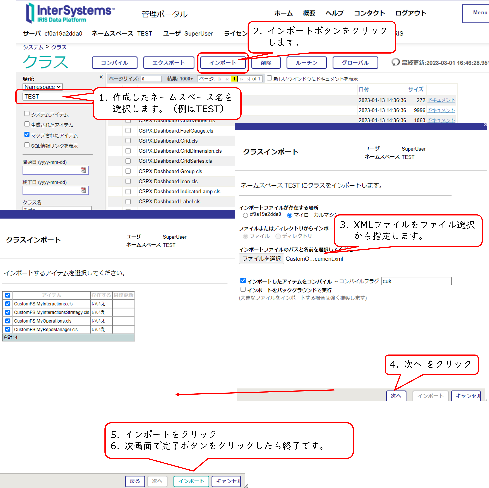

# カスタムオペレーション作成例：$documentに似たオペレーション
IRIS for Healthでは、[$document](https://www.hl7.org/fhir/composition-operation-document.html)をサポートしていないため、似た動作をカスタムオペレーションとして作成しました。

メモ：IRISがサポートしている[オペレーション](https://docs.intersystems.com/irisforhealthlatest/csp/docbookj/DocBook.UI.Page.cls?KEY=HXFHIR_server_arch_supported#HXFHIR_server_arch_supported_operations)

使用手順は、[こちら](#使用手順)をご覧ください。

## カスタムオペレーション作成概要
カスタムオペレーションの作成には、FHIRリポジトリのカスタマイズが必要です。

※リポジトリ作成前に必要なクラス群を作成しておく必要があります。

詳細は、以下記事をご参照ください。

- [FHIRリポジトリをカスタマイズしよう！パート１](https://jp.community.intersystems.com/node/504516)
- [FHIRリポジトリをカスタマイズしよう！パート2（カスタムOperation編）](https://jp.community.intersystems.com/node/504521)


## サンプルで用意したクラスについて
カスタムオペレーションの作成のため、以下のクラスを用意しています。

|作成したクラス名|定義内容|継承クラス|
|---|---|---|
|CustomFS.MyInteractionsStrategy|InteractionsClassパラメータ：：Interactionsクラスの名称を指定します<br>StrategyKeyパラメータ：キー名を指定します|HS.FHIRServer.Storage.Json.InteractionsStrategy|
|CustomFS.MyInteractions|OperationHandlerClassパラメータ<br>このパラメータにカスタムオペレーション用処理を書いたクラス名を指定します|HS.FHIRServer.Storage.Json.Interactions|
|CustomFS.MyRepoManager|StrategyKeyパラメータ：MyInteractionsStrategyクラスで指定したStrategyKeyを指定します<br>StrategyClassパラメータ：CustomFS.MyInteractionsStrategyを指定します|HS.FHIRServer.Storage.Json.RepoManager|
|CustomFS.MyOperations|オペレーションの処理を記述するクラス|HS.FHIRServer.Storage.BuiltInOperations|

## 使用手順
※ IRIS for Health 2021.1以降をご利用ください。

1. [ネームスペース、データベースの用意](#1ネームスペースデータベースの用意)
2. [サンプルクラスのインポート](#2サンプルクラスのインポート)
3. [FHIRリポジトリの作成](#3fhirリポジトリの作成)
4. [作成したオペレーションをCapability Statementに登録](#4作成したオペレーションをcapability-statementに登録)
5. [テスト](#5テスト)

___

### 1.ネームスペース、データベースの用意

管理ポータル > Health > **Installer Wizard** の画面を利用します。

LocalNameに作成するネームスペース名を指定します。


### 2.サンプルクラスのインポート

VSCodeからインポートする場合は、[CustomFS](CustomFS)フォルダ以下 *.clsをご利用ください。

管理ポータルからインポートする場合は、[CustomOperationMyDocument.xml](CustomOperationMyDocument.xml)を使用すると１回の操作でインポートが完了します。

図例：管理ポータルからクラス定義をインポートする方法

管理ポータル > システムエクスプローラ > クラス > ネームスペースを選択 > インポートボタンクリック



### 3.FHIRリポジトリの作成

[1.ネームスペースデータベースの用意](#1ネームスペースデータベースの用意)で作成したネームスペースにFHIRリポジトリを作成します。

**管理ポータル > Health > ネームスペース選択（例：TEST） > FHIR Configuration > Server Configuration**

Add Endpointボタンをクリックし、**Core FHIR package** に `hl7.fhir.r4.core@4.0.1` を指定します。

**Interactions strategy class**にインポートした `CustomFS.MyInteractionsStrategy`を指定します。


### 4.作成したオペレーションをCapability Statementに登録

エンドポイントの作成が完了したら、インポートしたカスタムオペレーション用をCapability Statementに登録するため、ターミナルで専用ユーティリティを実行します。

```
irisowner@cf0a19a2dda0:/opt/try$ iris session iris -U TEST

ノード: cf0a19a2dda0 インスタンス: IRIS

TEST>do ##class(HS.FHIRServer.ConsoleSetup).Setup()
Query returns no results
HS.FHIRServer.Installer:InstallNamespace Created FHIR web application
HS.FHIRServer.Installer:InstallNamespace Created FHIR API web application
What do you want to do?
  0)  Quit
  1)  Create a FHIRServer Endpoint
  2)  Add a profile package to an endpoint
  3)  Display a FHIRServer Endpoint Configuration
  4)  Configure a FHIRServer Endpoint
  5)  Decommission a FHIRServer Endpoint
  6)  Delete a FHIRServer Endpoint
  7)  Update the CapabilityStatement Resource
  8)  Index new SearchParameters for an Endpoint
  9)  Upload a FHIR metadata package
  10) Delete a FHIR metadata package
Choose your Option[1] (0-10): 7

For which Endpoint do you want to update the CapabilityStatement?
  1) /csp/healthshare/test/fhir/r4 [enabled] (for Strategy 'MyCustomFS' and Metadata Set 'hl7.fhir.r4.core@4.0.1')
Choose the Endpoint[1] (1-1): 1
Update the /csp/healthshare/test/fhir/r4 service CapabilityStatement to reflect the endpoint strategy. Proceed? (y/n): yes

What do you want to do?
  0)  Quit
  1)  Create a FHIRServer Endpoint
  2)  Add a profile package to an endpoint
  3)  Display a FHIRServer Endpoint Configuration
  4)  Configure a FHIRServer Endpoint
  5)  Decommission a FHIRServer Endpoint
  6)  Delete a FHIRServer Endpoint
  7)  Update the CapabilityStatement Resource
  8)  Index new SearchParameters for an Endpoint
  9)  Upload a FHIR metadata package
  10) Delete a FHIR metadata package
Choose your Option[7] (0-10): 0

TEST>
```

登録が正しく行えたかどうか、metaデータをGET要求で参照します。
`http://localhost:52773/csp/healthshare/test/fhir/r4/metadata`

正しく登録できると、HTTP応答の下のほうに以下の記述を確認できます。
```
{
    "name": "mydocument",
    "definition": "http://myfhirserver/fhir/OperationDefinition/Composition-mydocument"
}
```
上記内容を確認できたら、テスト実行を行ってください。

### 5.テスト

テスト登録用退院時サマリのBundleリソース[dischargesummary-transaction.json](dischargesummary-transaction.json)をPOST要求でリポジトリに登録します。

URL例）`localhost:52773/csp/healthshare/test/fhir/r4/`

POST実行が完了したら、CompositionリソースのIDをHTTP応答から確認し、カスタムオペレーションをテストするため、以下GET要求を実行します。

例）CompositionリソースのIDが9 の場合の実行例
`http://localhost:52773/csp/healthshare/test/fhir/r4/Composition/9/$mydocument`

（テスト用BundleリソースのPOST要求を実行した場合、上記GET要求のBundle.totalは9件です）


 
